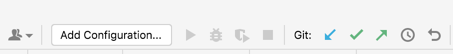
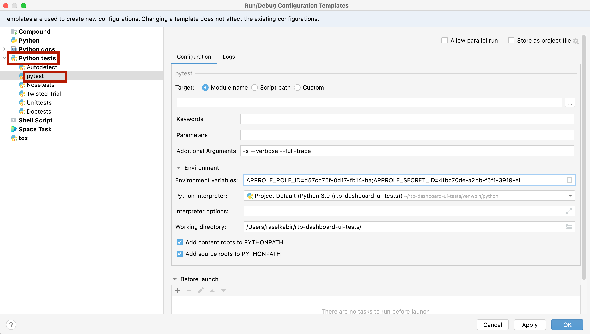

# RTB UI tests

We need to cover our DSP Dashboard system flows with selenium tests.

This is a test project written in `python3`.

To run this first clone this repo in your machine. Create a virtual environment with `venv`. Give these following
commands to setup the environment:

```
$python3 -m venv venv
$source venv/bin/activate
$pip install -r requirements.txt
```

## Install chrome webdriver using Homebrew

### Steps to install Homebrew

To install the Homebrew in your mac, run the following command:

_/bin/bash -c "$(curl -fsSL https://raw.githubusercontent.com/Homebrew/install/HEAD/install.sh)"_

### Steps to install chrome webdriver using Homebrew

The easiest way to install ChromeDriver is to use your package manager such as brew to install the driver.

In your terminal window with the Homebrew package manager:

Install ChromeDriver with **_brew install --cask chromedriver_** command

Confirm it was installed using **_chromedriver --version_** command and seeing it returns a version. If it errors it
wasn’t installed

## Credentials

For connecting to mysql from local we use **_SSH tunnel/ Eskimi VPN_**. Please contact SRE for credential issues.

Need access permission for the following vault path also:

1.`rtb/approle/dsp-dashboard-ui-test-(user)`

2.`mysql/rtb-dsp/dsp-app-ui-test `

## Local Debugging (Terminal)

Clone this repository and navigate to the root directory of the test UI automation project.
Create your local configuration file:

```
$cp local.ini.dist local.ini
```

Edit `local.ini` with the necessary information:

```
[credential]
username = AutomationAdminUser
password = Provide the user password
url = https://dsp-stage.eskimi.com
prod-url = https://dsp.eskimi.com
user-id = Provide test user id
api-url = https://{}.eskimi.com/
prod-api-url = https://{}.eskimi.com/
client-id = Provide client id for API access
client-secret = Provide client secret for API access

[debugger_credentials]
debugging-username = Provide debugging username to run cron jobs
debugging-password = Provide debugging password to run cron jobs

[mysql_credentials]
username = Provide db username to connect with database
password = Provide db password to connect with database
```

### Now to execute single test case follow the below steps:

1. Navigate to the root directory of the test UI automation project
2. Open `local_run.sh` and update the following variables:

```
# Set variables
PATH_TO_TEST="tests/CREATIVE/test_creatives.py" (This is the path of perticular test file)
TEST_CASE_NAME="test_dashboard_creative_copy_creative_to_another_user_banner" (This is the perticular test case name)
```

3. In the terminal, navigate to the root directory and run the script:

```commandline
bash local_run.sh
```

### Execute All Test Cases from a Specific Test File:

1. Navigate to the root directory of the test UI automation project
2. Open `local_run.sh` file and update the following variables:

```
# Set variables
PATH_TO_TEST="tests/CREATIVE/test_creatives.py" (This is the path of perticular test file)
TEST_CASE_NAME="" (Leave this variable empty)
```

3. In the terminal, navigate to the root directory and run the script:

```commandline
bash local_run.sh
```

### Execute All Test Cases from All Test Files:

1. Navigate to the root directory of the test UI automation project
2. Open `local_run.sh` file and update the following variables:

```
# Set variables
PATH_TO_TEST="" (Leave this variable empty)
TEST_CASE_NAME="" (Leave this variable empty)
```

3. In the terminal, navigate to the root directory and run the script:

```commandline
bash local_run.sh
```

## Local Debugging (PyCharm)

For generating run configurations run the following command to collect the list of available tests.

```
$ APPROLE_ROLE_ID={YOUR-VAULT-ROLE-ID} APPROLE_SECRET_ID={YOUR-VAULT-SECRET} python -m pytest --collect-only
```

Copy and format the output to `_tools/runconfig_generator/_test_list.txt` file.

Run the following script to generate run configurations:

```
$ APPROLE_ROLE_ID={YOUR-VAULT-ROLE-ID} APPROLE_SECRET_ID={YOUR-VAULT-SECRET} python _tools/runconfig_generator/runconfig_gen.py
```

Then copy them to your project run configurations folder.

```
$cp _tools/runconfig_generator/confs/* .idea/runConfigurations/
```

You'll be able to debug the tests from your IDE now with all the run configurations available.

**_In case facing any issue on the above steps just follow the following steps to make it manually_**

`Step 1: Click on the 'Add Configuration' button at the top right corner of your 'PyCharm'`



`Step 2: Now from the 'Run/Debug Configurations' pop up, click on the 'Edit configurations template' button`

`Step 3: Expand the 'Python tests' and select 'pytest' option -->  Now fill up the form with the help of following
image:`

**Note:** **'Environment variables' and 'Working directory' field values will be user specific**



Now it's all set for you!!!

**To run any specific test case, just set the cursor anywhere in the test case and press 'control+shift+R' to start
running it**

**Note:** **'To apply the coding standards, Reload the project -> "right click" on the root project
"rtb-dashboard-ui-tests" -> click 'Reformat Code' -> Click 'Run'**

**Note:** **Link to coding standards to
follow : https://eskimi.atlassian.net/wiki/spaces/DEV/pages/2301132801/Python+coding+standards**